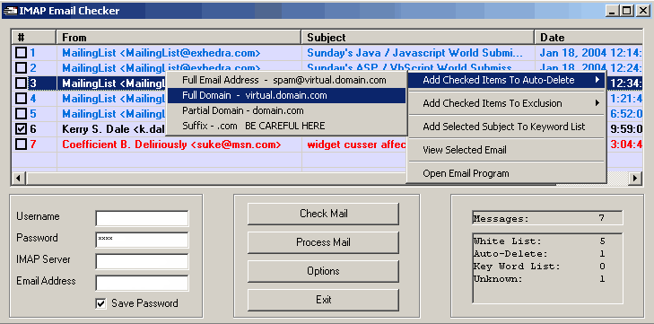



## IMAP Email Checker

### Description

There are several program that will let you check your emails & delete unwanted ones, but all of the ones I have seen here are POP examples. Using POP, you have to download the emails before you can delete them. Sometimes that can be real time consuming.

After searching for an example of how to check email using IMAP, and not finding any - I wrote this little program. Using IMAP, you can view the email headers (From, Subject etc...) and delete the unwanted emails without having to download them first.

The program uses AutoDelete, Exclusion list, Keyword checking. Your email server has to allow IMAP to be able to use this program. Includes lots of useful functions you can use in your own code. Thanks to Randy Beach (http://vbnet.mvps.org/) for the modWindows file.
 
### More Info
 

             |
---                |---
**Submitted On**   |2004-01-19 20:08:02
**By**             |[Magoo2](https://github.com/Planet-Source-Code/PSCIndex/blob/master/ByAuthor/magoo2.md)
**Level**          |Intermediate
**User Rating**    |4.4 (22 globes from 5 users)
**Compatibility**  |VB 5\.0, VB 6\.0
**Category**       |[Complete Applications](https://github.com/Planet-Source-Code/PSCIndex/blob/master/ByCategory/complete-applications__1-27.md)
**World**          |[Visual Basic](https://github.com/Planet-Source-Code/PSCIndex/blob/master/ByWorld/visual-basic.md)
**Archive File**   |[IMAP\_Email1696841192004\.zip](https://github.com/Planet-Source-Code/magoo2-imap-email-checker__1-51077/archive/master.zip)

